# Module 11 Challenge: Forecasting Net Prophet

## Background

In this scenario, you’re a growth analyst at [Mercado Libre](http://investor.mercadolibre.com/investor-relations). With over 200 million users, Mercado Libre is the most popular e-commerce site in Latin America. You've been tasked with analyzing the company's financial and user data in clever ways to help the company grow.

In this notebook contains the following:

- Visual depictions of seasonality (as measured by Google Search traffic) that are of interest to the company.

- An evaluation of how the company stock price correlates to its Google Search traffic.

- A Prophet forecast model that can predict hourly user search traffic.

- Answers to the questions in the instructions that you write in your Jupyter notebook.

- (Optional) A plot of a forecast for the company’s future revenue.

---

### Step 1: Find Unusual Patterns in Hourly Google Search Traffic

The data science manager at Mercado Libre asks you if the Google search traffic for the company links to any financial events at the company. Or, does the search traffic data just present random noise? To answer this question, you’ll pick out any unusual patterns in the Google search data for the company, and connect them to the corporate financial events.

Answering the question requires you to complete the following steps:

1. Read the search data into a DataFrame, and then slice the data to just the month of May 2020. (During this month, Mercado Libre released its quarterly financial results.) Use hvPlot to visualize the results. Do any unusual patterns exist?

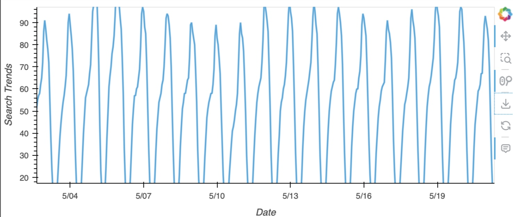

2. Calculate the total search traffic for the month, and then compare the value to the monthly median across all months. Did the Google search traffic increase during the month that Mercado Libre released its financial results?

traffic_may_2020 = 38181
median_monthly_traffic = 35172.5

**Question:** Did the Google search traffic increase during the month that MercadoLibre released its financial results?

**Answer:** Search traffic for May 2020 is higher than the overall monthly median value. As the result shown above, the releasing of MercadoLibre's financial results effected the Google search traffic rise.

### Step 2: Mine the Search Traffic Data for Seasonality

The Marketing department realizes that they can use the hourly search data, too. If they can track and predict interest in the company and its platform for any time of day, they can focus their marketing efforts around the times that have the most traffic. This will get a greater return on investment (ROI) from their marketing budget.

To help Marketing, you'll want to mine the search traffic data for predictable seasonal patterns of interest in the company. Complete the following steps:

1. Group the hourly search data to plot the average traffic by the day of the week (for example, Monday vs. Friday).

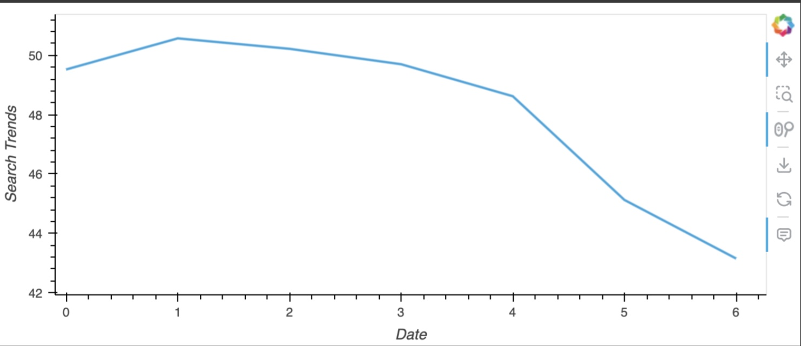

2. Using hvPlot, visualize this traffic as a heatmap, referencing `index.hour` for the x-axis and `index.dayofweek` for the y-axis. Does any day-of-week effect that you observe concentrate in just a few hours of that day?

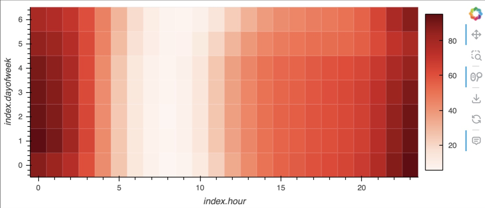

**Question:** Does any day-of-week effect that you observe concentrate in just a few hours of that day?

**Answer:** Based on the graph above, it looks like searching intensity is highest at around midnight of each day (23:00-01:00), regardless of what day of the week it is. The exception is probably Saturday and Sunday (index.dayofweek==5,6): the deep dark red at the bottom right here indicates that searching activity is usually large on Tuesday the hour before and after midnight.

3. Group the search data by the week of the year. Does the search traffic tend to increase during the winter holiday period (weeks 40 through 52)?

**Question:** Does the search traffic tend to increase during the winter holiday period (weeks 40 through 52)?

**Answer:** The search traffic increased from the week 42 and it was peak at weeks 51 before it plummeted in weeks 52. Consequently, the search traffic was not an increase trend throughout the winter holiday period (weeks 40 through 52).

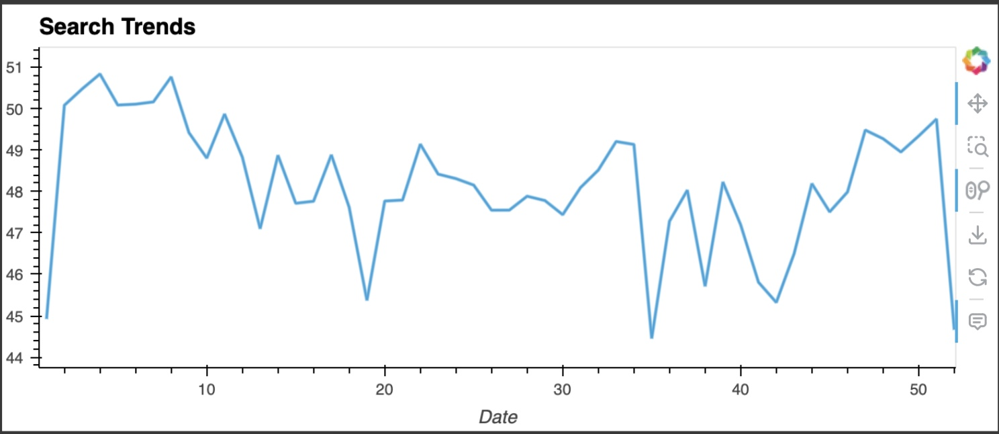

### Step 3: Relate the Search Traffic to Stock Price Patterns

During a meeting with people in the Finance group, you mention your work on the search traffic data. They want to know if any relationship between the search data and the company stock price exists, and they ask if you can investigate.

You can find out the answer by completing the following steps:

1. Read in and plot the stock price data. Concatenate the stock price data to the search data in a single DataFrame.

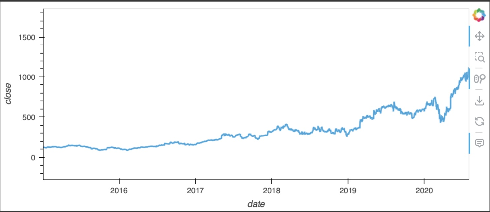

2. Note that market events emerged during 2020 that many companies found difficult. But after the initial shock to global financial markets, new customers and revenue increased for e-commerce platforms. So, slice the data to just the first half of 2020 (`2020-01` to `2020-06` in the DataFrame), and then use hvPlot to plot the data. Do both time series indicate a common trend that’s consistent with this narrative?

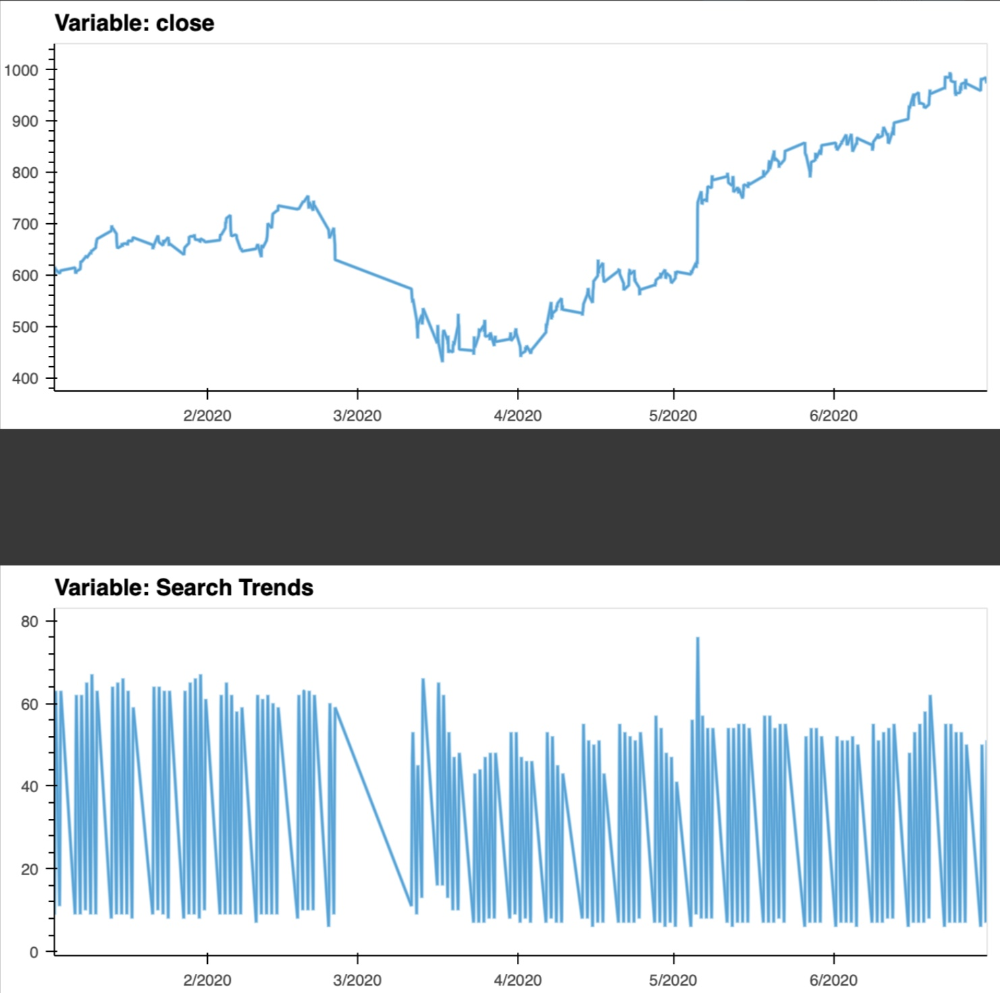

**Question:** Do both time series indicate a common trend that’s consistent with this narrative?

**Answer:** Yes, the both time series indicate a common trend that’s consistent with this narrative. As the plots shown, the both plots are mostly the same pattern, therefore, the search traffics and stock price changes are highly correlation.

3. Create a new column in the DataFrame named “Lagged Search Trends” that offsets, or shifts, the search traffic by one hour. Create two additional columns:

   - “Stock Volatility”, which holds an exponentially weighted four-hour rolling average of the company’s stock volatility
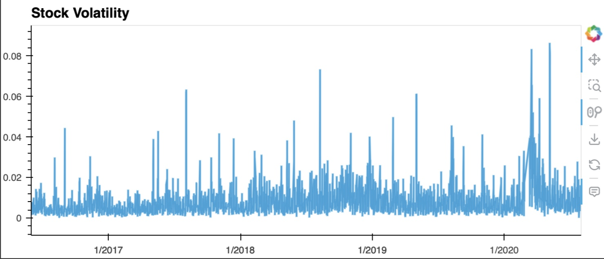

   - “Hourly Stock Return”, which holds the percentage of change in the company stock price on an hourly basis
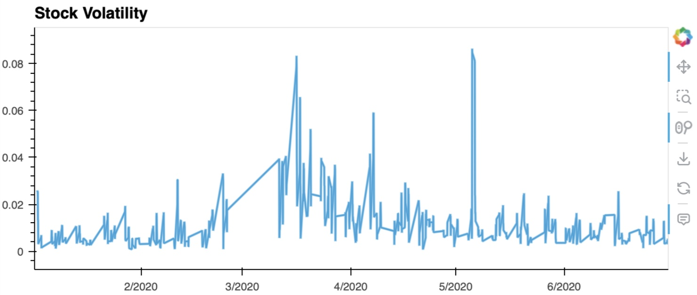

4. Review the time series correlation, and then answer the following question: Does a predictable relationship exist between the lagged search traffic and the stock volatility or between the lagged search traffic and the stock price returns?
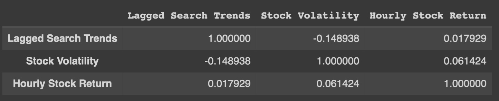

**Question:** Does a predictable relationship exist between the lagged search traffic and the stock volatility or between the lagged search traffic and the stock price returns?

**Answer:** A predictable relationship exists between the lagged search traffic and the stock volatility, however; it is a negative correlation. Besides, the relationship between the lagged search traffic and the stock price returns seems to be a weakly positive correlation.

### Step 4: Create a Time Series Model by Using Prophet

Now, you need to produce a time series model that analyzes and forecasts patterns in the hourly search data. Complete the following steps to create the model:

1. Set up the Google search data for a Prophet forecasting model.

2. After estimating the model, plot the forecast. What is the near-term forecast for the popularity of Mercado Libre?
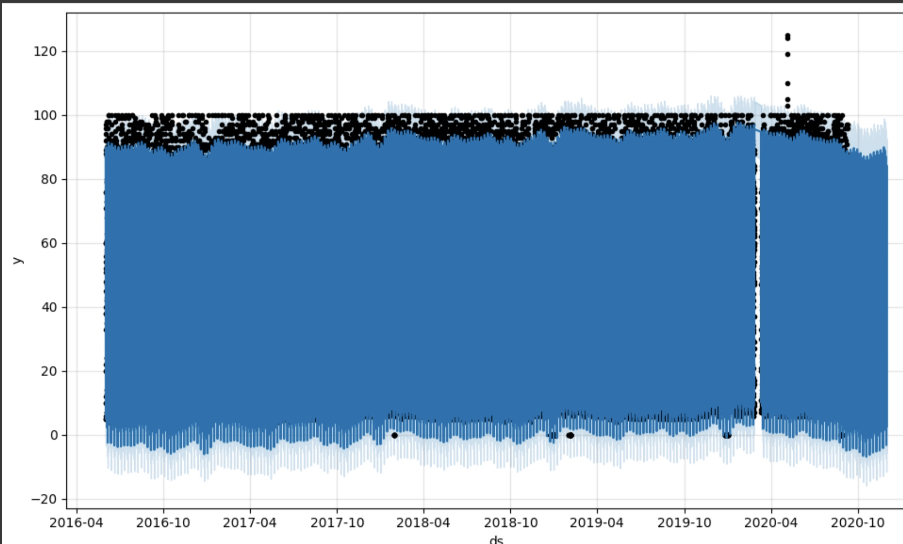

**Question:**  How's the near-term forecast for the popularity of MercadoLibre?

**Answer:** MercadoLibre seems to be getting more popular in the future.

3. Plot the individual time series components of the model to answer the following questions:

**Question:** What time of day exhibits the greatest popularity?

**Answer:** The midnight time seems to be the peak time.

**Question:** Which day of week gets the most search traffic?
   
**Answer:** Tuesday.

**Question:** What's the lowest point for search traffic in the calendar year?

**Answer:** The lowest point for search traffic in the calendar year is around the mid of October month.

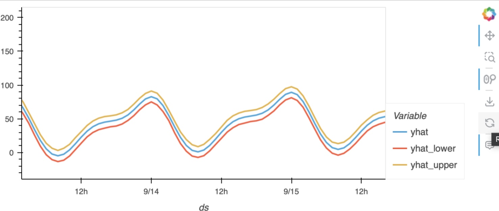
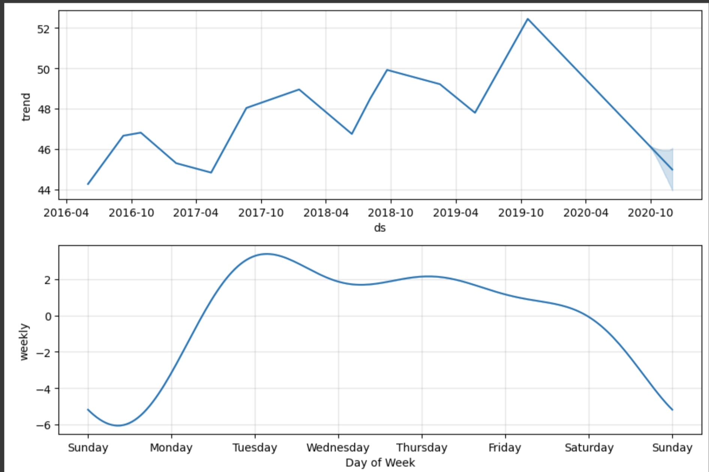
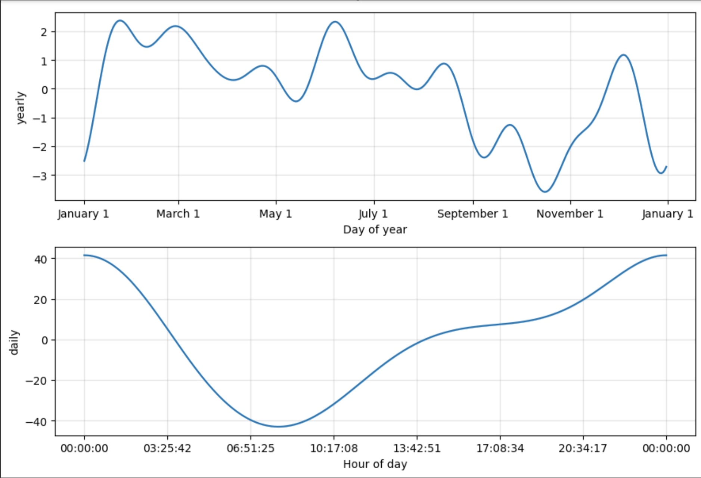

### Step 5 (Optional): Forecast the Revenue by Using Time Series Models

A few weeks after your initial analysis, the finance group follows up to find out if you can help them solve a different problem. Your fame as a growth analyst in the company continues to grow!

Specifically, the finance group wants a forecast of the total sales for the next quarter. This will dramatically increase their ability to both plan budgets and help guide expectations for the company investors.

To create the forecast, complete the following steps:

1. Read in the daily historical sales (that is, revenue) figures, and then apply a Prophet model to the data.
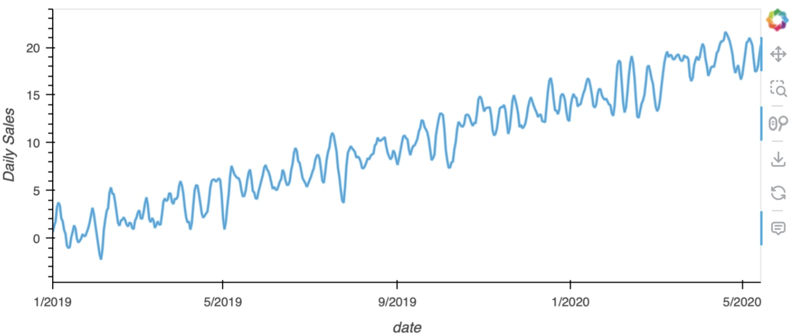

2. Interpret the model output to identify any seasonal patterns in the company revenue. For example, what are the peak revenue days? (Mondays? Fridays? Something else?)
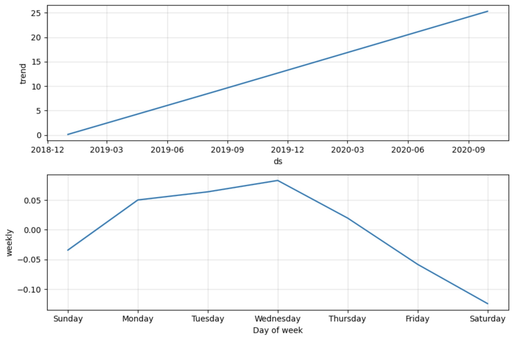
##### Answer the following question: The company's revenues are predicted to be growth.

**Question:** For example, what are the peak revenue days? (Mondays? Fridays? Something else?)

**Answer:** Wednesday.

3. Produce a sales forecast for the finance group. Give them a number for the expected total sales in the next quarter. Include the best- and worst-case scenarios to help them make better plans.
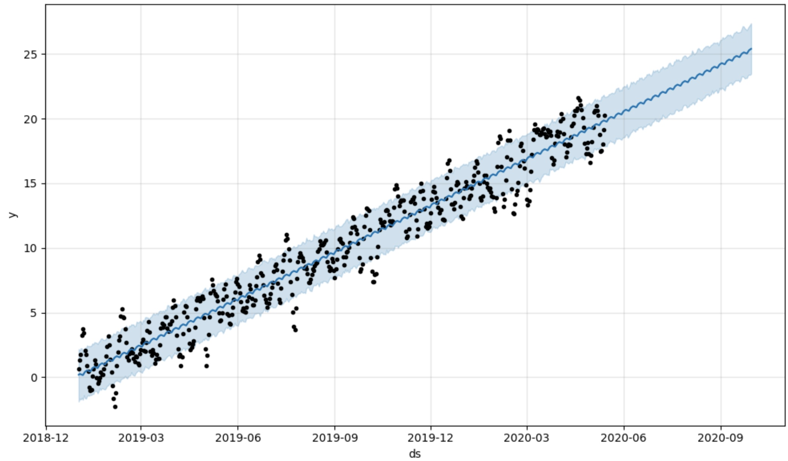

### Based on the forecast information generated above, produce a sales forecast for the finance division, giving them a number for expected total sales next quarter. Include best and worst case scenarios, to better help the finance team plan.

**Answer:** In conclusion, the most likely forecast revenue case for the next quarter seems to be double of the average revenue of the last two quarters. Moreover, the worst case seems is look like to be better than the last two quarter as well. According to the numbers of expected total sales for the next quarter, we assume that the MercadoLibre company has potential to continue growing their business.

---
